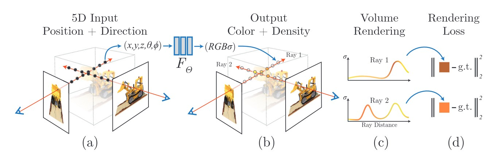
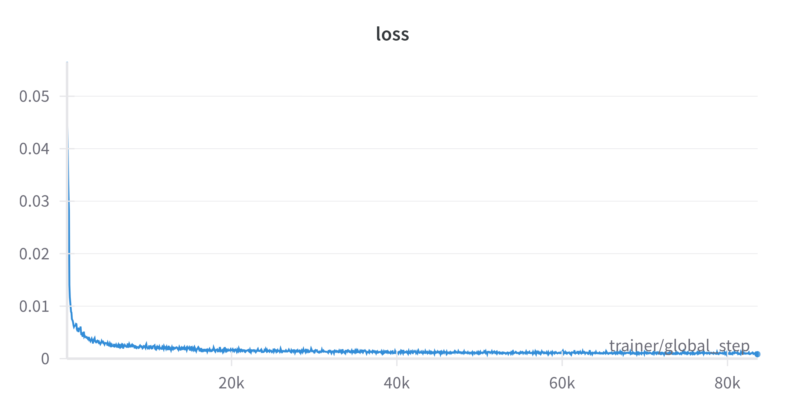
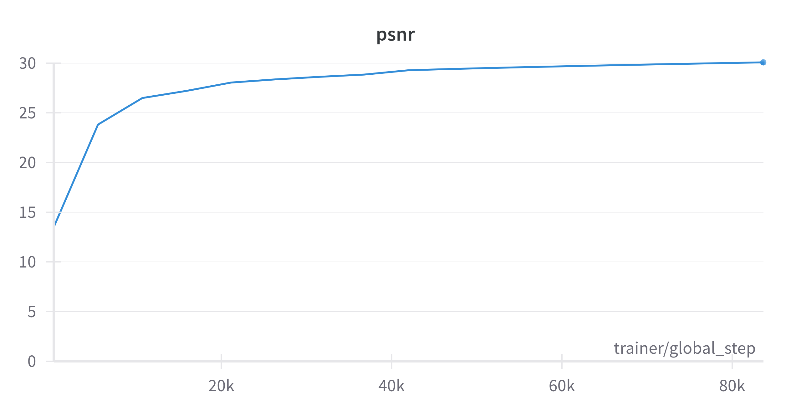

# Neural Radiance Fields
> A neural radiance field ( [NeRF](https://arxiv.org/abs/2003.08934) ) is a simple fully connected network (weights are ~5MB) trained to reproduce input views of a single scene using a rendering loss. The network directly maps from spatial location and viewing direction (5D input) to color and opacity (4D output), acting as the "volume" so we can use volume rendering to differentiably render new views.

<table>
  <tr>
    <td align="center"><br>Pipeline</td>
  </tr>
</table>

1. [Setup](#Setup)
2. [Training](#Training)
3. [Evaluation](#Evaluation)
4. [References and Citations](#References-and-Citations)

<!--<div align="center">
  
</div>-->
<table>
  <tr>
    <td align="center"><br>Novel Views</td>
    <td align="center"><br>3D Reconstruction</td>
  </tr>
</table>

- Training graphs

<table>
  <tr>
    <td align="center"><br>Loss</td>
    <td align="center"><br>PSNR</td>
  </tr>
</table>

- Device used: [TITAN X (Pascal) 250W / 12GB RAM](outputs/gpu.txt)

- Time to train: 12h 30m
 
- Training Dashboard: https://wandb.ai/stanleyedward/LegoNeRF/runs/h6yb8pnb/overview

   |      Testing Metrics    | Values   |
    | :---:     |  :---:                 |
    | **Avg Loss**  |  0.0012457877128773586 |
    | **Avg PSNR**  |  29.200356294523996   |


### Setup
1. #### Clone and cd into the repository:

    ```sh
    git clone https://github.com/stanleyedward/nerf_pytorch_lightning.git
    cd nerf_pytorch_lightning
     ```

2. #### Create and activate the conda environment:

    ```sh
    conda env create -f environment.yaml
    conda activate nerf
    ```

3. #### Add the dataset to the `dataset/` directory:
- > Download Lego Dataset: https://drive.google.com/drive/folders/1lrDkQanWtTznf48FCaW5lX9ToRdNDF1a

    ```sh
    dataset/
    ├── dataset_link.md
    └── lego
        ├── test
        ├── train
        ├── transforms_test.json
        ├── transforms_train.json
        ├── transforms_val.json
        └── val
    ```

### Training
`note:` [Setup](#Setup) should be complete

1. #### Change configurations 
    In the [config.py](config.py) file

    ```py
    """------------------------NeRF Config------------------------"""
    # data
    IMG_SIZE: int = 400
    BATCH_SIZE: int = 3072
    ...
    DEVICES: int = torch.cuda.device_count()
    MAX_EPOCHS: int = 17
    ```
2. #### Run the [train.py](train.py) script
    ```sh
    python train.py
    ```

### Evaluation
`note:` [Setup](#Setup) should be complete

1. #### Change configurations 
    In the [config.py](config.py) file

    ```py
    """------------------------NeRF Config------------------------"""
    ...
    #eval
    CKPT_DIR: str = "models/16_epoch_192_bins_400_nerf.ckpt" 
    CHUNK_SIZE: int = 20  # increase chunksize prevent CUDA out of memory errors
    OUTPUTS_DIR: str = "outputs" #folder you want to save the novel views in
    ```
2. #### Run the [eval.py](eval.py) script
    ```sh
    python eval.py
    ```


### References and Citations

- Neural radiance field. (2024, April 18). In Wikipedia. https://en.wikipedia.org/wiki/Neural_radiance_field
  
- https://github.com/MaximeVandegar/Papers-in-100-Lines-of-Code/tree/main/NeRF_Representing_Scenes_as_Neural_Radiance_Fields_for_View_Synthesis
  
```
@misc{mildenhall2020nerf,
    title={NeRF: Representing Scenes as Neural Radiance Fields for View Synthesis},
    author={Ben Mildenhall and Pratul P. Srinivasan and Matthew Tancik and Jonathan T. Barron and Ravi Ramamoorthi and Ren Ng},
    year={2020},
    eprint={2003.08934},
    archivePrefix={arXiv},
    primaryClass={cs.CV}
}
```

```
@misc{queianchen_nerf,
  author={Quei-An, Chen},
  title={Nerf_pl: a pytorch-lightning implementation of NeRF},
  url={https://github.com/kwea123/nerf_pl/},
  year={2020},
}
```

```
@misc{lin2020nerfpytorch,
  title={NeRF-pytorch},
  author={Yen-Chen, Lin},
  publisher = {GitHub},
  journal = {GitHub repository},
  howpublished={\url{https://github.com/yenchenlin/nerf-pytorch/}},
  year={2020}
}
```
